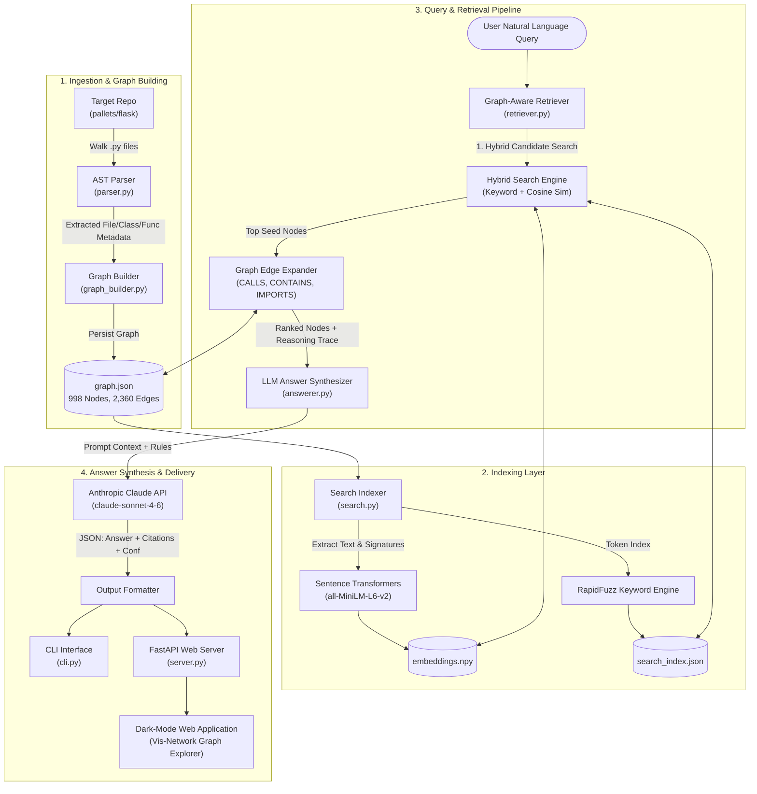

# RepoGraph AI — System Architecture

This document describes the high-level architecture, components, and data flow of RepoGraph AI.

---

## Target Repository Scope

- **Repository**: `pallets/flask`
- **Pinned Commit Hash**: `36e4a824f340fdee7ed50937ba8e7f6bc7d17f81`
- **Scope Metrics**: **82 parsed files** | **18,236 lines of code**
- **Graph Size**: **998 Nodes** | **2,360 Edges**

---

## High-Level Architecture & Data Flow

---

## Component Breakdown & Graph Model

### 1. Ingestion Engine (`parser.py`)
- **Technology**: Python's native `ast` module (zero regex).
- **Function**: Traverses target repository `.py` source files.
- **Outputs**:
  - File details & imports (`import`, `from ... import`, relative dot resolution).
  - Class definitions, parent base classes, docstrings, line numbers.
  - Top-level functions & methods, signatures, arguments, call expressions.
  - Route decorators (`@app.route`, `@bp.route`, `@bp.get`, etc.) and module-level config constants.

### 2. Graph Builder & Knowledge Graph Model (`graph_builder.py`)
- **Graph Model**:
  - **Node Types**:
    - `File`: Source module nodes containing `config_constants` (list of literal `{name, value, line}` constants).
    - `Class`: Class definition nodes with base class hierarchies (`bases`) and decorators.
    - `Function`: Top-level functions and methods containing `is_route` (boolean flag for HTTP routes), `route_decorators` (list of attached route decorators like `["bp.get"]`), and `is_config` (boolean flag for configuration loading methods).
  - **Edge Types**:
    - `CONTAINS`: Structural containment (File→Class, File→Function, Class→Method).
    - `CALLS`: Function-to-function calls via AST call analysis.
    - `IMPORTS`: File-to-file import dependencies resolved via relative module paths.
- **Persistence**: Structured JSON (`graph.json`) matching [./SCHEMA.md](./SCHEMA.md).

### 3. Search Engine (`search.py`)
- **Hybrid Retrieval Strategy**:
  - **Keyword/Symbol Match**: `rapidfuzz` string similarity + exact symbol lookup on node names and docstrings.
  - **Semantic Vector Match**: `sentence-transformers` (`all-MiniLM-L6-v2`) generating 384-dimensional dense vectors for node names + docstrings + signatures.
  - **Score Fusion**: Weighted combination (`0.4 * keyword_score + 0.6 * semantic_score`).

### 4. Graph-Aware Retriever (`retriever.py`)
- **Candidate Retrieval**: Gets top hybrid candidate seed nodes.
- **Neighborhood Expansion**: Traverses graph edges 1 to 2 hops out:
  - Follows `CONTAINS` edges to retrieve parent classes/files and sibling methods.
  - Follows `CALLS` edges to retrieve callers and callees.
  - Follows `IMPORTS` edges to retrieve dependent file modules.
- **Reasoning Trace Generation**: Records explicit step-by-step reasons for every node included in the context window.

### 5. Answer Synthesizer (`answerer.py`)
- **LLM Prompting**: Prompts Anthropic Claude API (`claude-sonnet-4-6`).
- **Citation Enforcement**: Every factual claim is tagged with `[file:symbol:line]`.
- **Confidence Scoring**: Assigns 0.0 to 1.0 confidence score with sentence justification.
- **Low Confidence Safeguard**: If evidence is missing (e.g., out-of-scope query like Kafka), system enforces an explicit "I don't know" answer.

### 6. User Interfaces (`cli.py`, `server.py`, `frontend/src/App.jsx`)
- **CLI**: Terminal interface for `index` and `ask` commands (`python3 cli.py ask "<question>"`).
- **FastAPI Web Server**: REST API providing stats, node detail lookups, node creation endpoints, graph network dataset, and Q&A endpoints.
- **Monochrome React SPA**: Professional black-and-white React single-page application built with Vite and Three.js. Features:
  - **3D WebGL Knowledge Graph Explorer**: Interactive 3D force-directed graph visualizer (`3d-force-graph` + WebGL) with 360° orbit rotation, smooth camera fly-to animations, node property inspector panel, connected edge navigation, search/highlighting, and custom node creation modal.
  - **Ask AI Prompt Interface**: Natural-language query launcher with confidence indicators, inline `[file:symbol:line]` citations, and reasoning trace logs.
  - **Schema & Node Directory**: Real-time searchable and filterable directory table of all parsed AST nodes.
